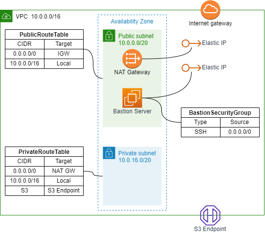

# Create a virtual network

## AWS Architecture to be created



- VPC
    - AWS::EC2::VPC
    - AWS::EC2::InternetGateway
- Public/Private Subnet
    - AWS::EC2::Subnet
    - AWS::EC2::RouteTable
- NAT Gateway
    - AWS::EC2::EIP
    - AWS::EC2::NatGateway
- S3 EndPoint
    - AWS::EC2::VPCEndpoint
- Bastion Server
    - AWS::EC2::SecurityGroup
    - AWS::EC2::KeyPair
    - AWS::EC2::EIP
    - AWS::EC2::Instance

## How to run

```sh
Region=ap-northeast-1
SystemName=sample
AvailabilityZone=ap-northeast-1a

aws cloudformation deploy \
--region "${Region}" \
--stack-name "${SystemName}"-virtual-network \
--template-file ./virtual-network.yaml \
--parameter-overrides \
SystemName="${SystemName}" \
AvailabilityZone="${AvailabilityZone}"
```
