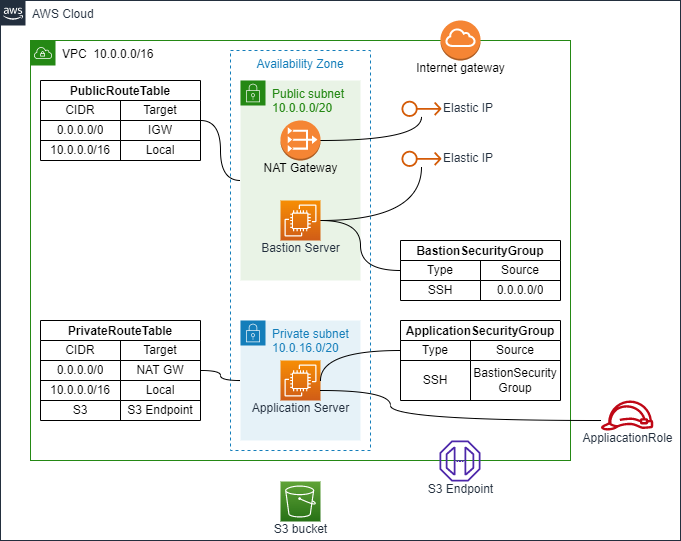

# Create an application server

## AWS Architecture to be created



- Application Server
    - AWS::EC2::SecurityGroup
    - AWS::EC2::KeyPair
    - AWS::EC2::Instance
    - AWS::IAM::Role

## How to run

[01_virtual_network](../01_virtual_network) needs to be created beforehand

```sh
Region=ap-northeast-1
OrganizationName=iwatake2222
SystemName=sample

aws cloudformation deploy \
--region "${Region}" \
--stack-name "${SystemName}"-app-server \
--template-file ./application-server.yaml \
--capabilities CAPABILITY_NAMED_IAM \
--parameter-overrides \
OrganizationName="${OrganizationName}" \
SystemName="${SystemName}"
```

## How to connect to an application server via a bastion server

- Replace ooo (hostname and instance id)
    - Hostname in aws_bastion: Public IPv4 Address of BastionInstance
    - Hostname in aws_app: Private IPv4 Address of ApplicationInstance

```
# ~/.ssh/config
Host aws_bastion
    Hostname ooo.ooo.ooo.ooo
    User ec2-user

Host aws_app
    Hostname 10.0.16.ooo
    User ec2-user
    ProxyCommand ssh aws_bastion -W %h:%p

host i-* mi-*
    ProxyCommand sh -c "aws ssm start-session --target %h --document-name AWS-StartSSHSession --parameters 'portNumber=%p'"
```

```sh
AvailabilityZone=ap-northeast-1a
AWS_BASTION_ID=i-ooo
AWS_APP_ID=i-ooo 

aws ec2-instance-connect send-ssh-public-key \
--instance-id "${AWS_BASTION_ID}" \
--availability-zone "${AvailabilityZone}" \
--instance-os-user ec2-user \
--ssh-public-key file://~/.ssh/id_rsa.pub

aws ec2-instance-connect send-ssh-public-key \
--instance-id "${AWS_APP_ID}" \
--availability-zone "${AvailabilityZone}" \
--instance-os-user ec2-user \
--ssh-public-key file://~/.ssh/id_rsa.pub

# ssh aws_bastion
#  or
ssh aws_app
```


## Test access to S3

```sh
OrganizationName=iwatake2222
SystemName=sample
dd if=/dev/zero of=dummy_file bs=1M count=100
aws s3 cp dummy_file s3://"${OrganizationName}-${SystemName}-02-bucket"
aws s3 ls s3://"${OrganizationName}-${SystemName}-02-bucket"
```

