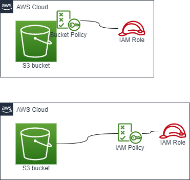

# Create an S3 bucket + Permissions

## AWS Architecture to be created



- S3 Bucket permitted by BucketPolicy
    - AWS::S3::Bucket
    - AWS::S3::BucketPolicy
- S3 Bucket permitted by IAM Policy
    - AWS::S3::Bucket
    - AWS::IAM::ManagedPolicy

## How to run

```sh
Region=ap-northeast-1
OrganizationName=iwatake2222
SystemName=sample-03-a

aws cloudformation deploy \
--region "${Region}" \
--stack-name "${SystemName}"-s3-permitted-by-bucket-policy \
--template-file ./s3-permitted-by-bucket-policy.yaml \
--capabilities CAPABILITY_NAMED_IAM \
--parameter-overrides \
OrganizationName="${OrganizationName}" \
SystemName="${SystemName}"
```

```sh
Region=ap-northeast-1
OrganizationName=iwatake2222
SystemName=sample-03-b

aws cloudformation deploy \
--region "${Region}" \
--stack-name "${SystemName}"-s3-permitted-by-iam-policy \
--template-file ./s3-permitted-by-iam-policy.yaml \
--capabilities CAPABILITY_NAMED_IAM \
--parameter-overrides \
OrganizationName="${OrganizationName}" \
SystemName="${SystemName}"
```

```sh
dd if=/dev/zero of=dummy_file bs=1M count=100
aws s3 cp dummy_file s3://"${OrganizationName}-${SystemName}-bucket"
aws s3 ls s3://"${OrganizationName}-${SystemName}-bucket"
```
