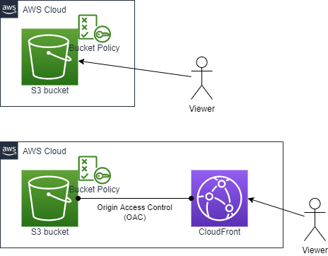

# Create an S3 bucket for hosting a static website

## AWS Architecture to be created



- S3 Bucket for hosting a static website
    - AWS::S3::Bucket
    - AWS::S3::BucketPolicy

- S3 Bucket + CloudFront (OAC) for hosting a static website
    - AWS::S3::Bucket
    - AWS::S3::BucketPolicy
    - AWS::CloudFront::Distribution
    - AWS::CloudFront::OriginAccessControl

## How to run

```sh
Region=ap-northeast-1
OrganizationName=iwatake2222
SystemName=sample-04-a

aws cloudformation deploy \
--region "${Region}" \
--stack-name "${SystemName}"-s3-hosting \
--template-file ./s3-hosting.yaml \
--parameter-overrides \
OrganizationName="${OrganizationName}" \
SystemName="${SystemName}"

echo hello > index.html
aws s3 cp index.html s3://"${OrganizationName}-${SystemName}-bucket"

curl http://"${OrganizationName}-${SystemName}-bucket".s3-website-ap-northeast-1.amazonaws.com
```

```sh
Region=ap-northeast-1
OrganizationName=iwatake2222
SystemName=sample-04-b

aws cloudformation deploy \
--region "${Region}" \
--stack-name "${SystemName}"-s3-cloudfront \
--template-file ./s3-cloudfront.yaml \
--parameter-overrides \
OrganizationName="${OrganizationName}" \
SystemName="${SystemName}"

echo hello > index.html
aws s3 cp index.html s3://"${OrganizationName}-${SystemName}-bucket"

aws cloudformation describe-stacks --stack-name "${SystemName}"-s3-cloudfront --query "Stacks[0].Outputs[?OutputKey=='CloudFrontDomainName'].OutputValue" --output text

curl https://oooooooooooooo.cloudfront.net
```
