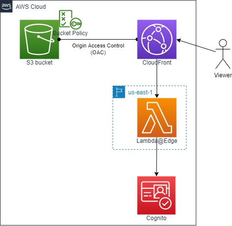

# Create an S3 bucket and CloudFront (OAC) for hosting a static website with Cognito authentification

## AWS Architecture to be created



- S3 Bucket
    - AWS::S3::Bucket
    - AWS::S3::BucketPolicy
- CloudFront (OAC)
    - AWS::CloudFront::Distribution
    - AWS::CloudFront::OriginAccessControl
- Authentification
    - AWS::Cognito::UserPool
    - AWS::Cognito::UserPoolDomain
    - AWS::Cognito::UserPoolClient
- Lambda@Edge for cognito-at-edge
    - AWS::Lambda::Function
    - AWS::IAM::Role

## How to run

```sh
Region=ap-northeast-1
RegionForLambdaEdge=us-east-1
OrganizationName=iwatake2222
SystemName=sample05

aws cloudformation deploy \
--region "${Region}" \
--stack-name "${SystemName}"-s3-cloudfront-cognito \
--template-file ./s3-cloudfront-cognito.yaml \
--parameter-overrides \
OrganizationName="${OrganizationName}" \
SystemName="${SystemName}"

echo hello > index.html
aws s3 cp index.html s3://"${OrganizationName}-${SystemName}-bucket"

aws cloudformation deploy \
--region "${RegionForLambdaEdge}" \
--stack-name "${SystemName}"-s3-cloudfront-cognito-lambda-edge \
--template-file ./s3-cloudfront-cognito-lambda-edge.yaml \
--capabilities CAPABILITY_NAMED_IAM \
--parameter-overrides \
OrganizationName="${OrganizationName}" \
SystemName="${SystemName}"

aws cloudformation describe-stacks --stack-name "${SystemName}"-s3-cloudfront-cognito

cd cognito-at-edge
# edit index.js
zip -r ../cognito-at-edge.zip ./*
cd ..
aws lambda update-function-code --region "${RegionForLambdaEdge}" --function-name "${SystemName}-lambda-edge" --zip-file fileb://cognito-at-edge.zip
```

## How to prepare cognito-at-edge

Please refer to https://github.com/awslabs/cognito-at-edge

```sh
mkdir -p cognito-at-edge && cd cognito-at-edge
npm install cognito-at-edge
nano index.js
```

## Reference

- https://docs.aws.amazon.com/ja_jp/AmazonCloudFront/latest/DeveloperGuide/private-content-restricting-access-to-s3.html
- https://github.com/awslabs/cognito-at-edge

