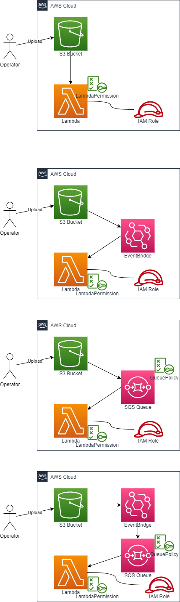

# Create a lambda function triggered by S3 upload (via Event Bridge)

## AWS Architecture to be created



- Lambda Function
    - AWS::Lambda::Function
    - AWS::IAM::Role
    - AWS::Lambda::Permission
    - AWS::S3::Bucket
    - AWS::Events::Rule

## How to run

```sh
Region=ap-northeast-1
OrganizationName=iwatake2222
SystemName=sample-06-a

aws cloudformation deploy \
--region "${Region}" \
--stack-name "${SystemName}"-lambda-s3 \
--template-file ./lambda-s3.yaml \
--capabilities CAPABILITY_NAMED_IAM \
--parameter-overrides \
OrganizationName="${OrganizationName}" \
SystemName="${SystemName}"
```

```sh
Region=ap-northeast-1
OrganizationName=iwatake2222
SystemName=sample-06-b

aws cloudformation deploy \
--region "${Region}" \
--stack-name "${SystemName}"-lambda-s3-event \
--template-file ./lambda-s3-event.yaml \
--capabilities CAPABILITY_NAMED_IAM \
--parameter-overrides \
OrganizationName="${OrganizationName}" \
SystemName="${SystemName}"
```

```sh
Region=ap-northeast-1
OrganizationName=iwatake2222
SystemName=sample-06-c

aws cloudformation deploy \
--region "${Region}" \
--stack-name "${SystemName}"-lambda-s3-sqs \
--template-file ./lambda-s3-sqs.yaml \
--capabilities CAPABILITY_NAMED_IAM \
--parameter-overrides \
OrganizationName="${OrganizationName}" \
SystemName="${SystemName}"
```

```sh
Region=ap-northeast-1
OrganizationName=iwatake2222
SystemName=sample-06-d

aws cloudformation deploy \
--region "${Region}" \
--stack-name "${SystemName}"-lambda-s3-event-sqs \
--template-file ./lambda-s3-event-sqs.yaml \
--capabilities CAPABILITY_NAMED_IAM \
--parameter-overrides \
OrganizationName="${OrganizationName}" \
SystemName="${SystemName}"
```

## How to test

```sh
touch dummy
aws s3 cp dummy s3://"${OrganizationName}-${SystemName}-bucket"
```

- AWS Console -> CloudWatch -> Log Group -> /aws/lambda/${SystemName}


## Reference

- https://github.com/aws-cloudformation/cloudformation-coverage-roadmap/issues/79#issuecomment-1012457735
