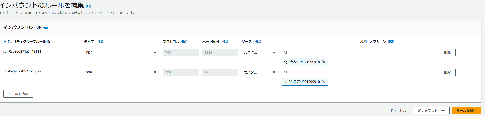
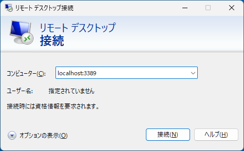
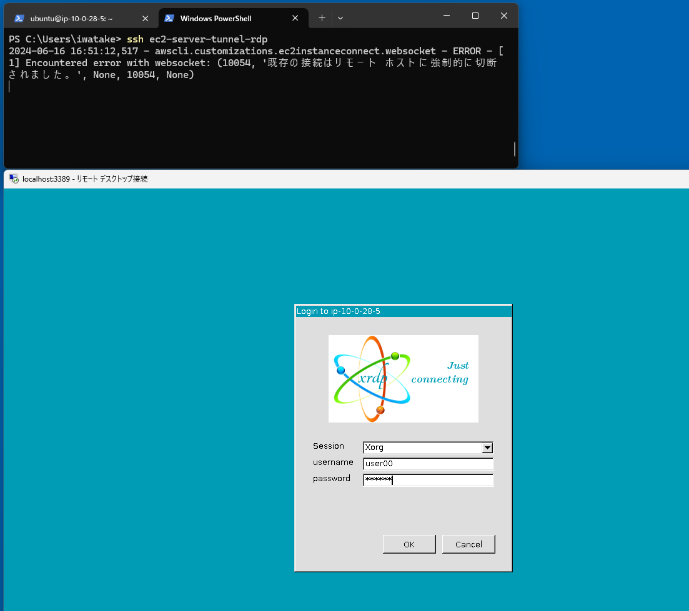
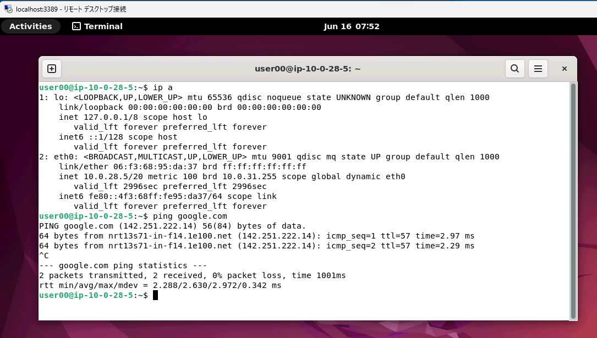

# Create an EC2 and connect using EC2 Instance Connect (EIC) Endpoint

## AWS Architecture

### EC2 in a Public Subnet


### EC2 in a Private Subnet


## How to deploy

- Select `SystemName` and `TemplateFileName` according to whether you want to place EC2 in a public subnet or in a private subnet

```sh
Region=ap-northeast-1
AvailabilityZone=ap-northeast-1a

SystemName=sample-ec2-eic-public
TemplateFileName=./ec2_eic_public.yaml

# SystemName=sample-ec2-eic-private
# TemplateFileName=./ec2_eic_private.yaml

aws cloudformation deploy \
--region "${Region}" \
--stack-name "${SystemName}" \
--template-file ${TemplateFileName} \
--capabilities CAPABILITY_NAMED_IAM \
--parameter-overrides \
SystemName="${SystemName}" \
AvailabilityZone="${AvailabilityZone}"
```

## How to connect to an EC2

### Easy test

```
aws ec2-instance-connect ssh --instance-id i-00000000000000000 --os-user ubuntu --connection-type eice
```

### SSH

- Configure `~/.ssh/config`
  - Push SSH key, then open SSH tunnel

```
# ~/.ssh/config
Host i-* mi-*
    ProxyCommand sh -c "aws ec2-instance-connect send-ssh-public-key --instance-id %h --instance-os-user %r --ssh-public-key 'file://~/.ssh/id_rsa.pub' && aws ec2-instance-connect open-tunnel --instance-id %h"

# (Optional) To specify host id
Host ec2-server
    HostName i-00000000000000000
    User ubuntu
    ProxyCommand sh -c "aws ec2-instance-connect send-ssh-public-key --instance-id %h --instance-os-user %r --ssh-public-key 'file://~/.ssh/id_rsa.pub' && aws ec2-instance-connect open-tunnel --instance-id %h"

# (Optional) Sample to create tunnel
Host ec2-server-tunnel
    HostName i-00000000000000000
    User ubuntu
    ProxyCommand sh -c "aws ec2-instance-connect send-ssh-public-key --instance-id %h --instance-os-user %r --ssh-public-key 'file://~/.ssh/id_rsa.pub' && aws ec2-instance-connect open-tunnel --instance-id %h --remote-port 22 --local-port 2222"

Host ec2-server-tunnel-rdp
    HostName i-00000000000000000
    User ubuntu
    ProxyCommand sh -c "aws ec2-instance-connect send-ssh-public-key --instance-id %h --instance-os-user %r --ssh-public-key 'file://~/.ssh/id_rsa.pub' && aws ec2-instance-connect open-tunnel --instance-id %h --remote-port 3389 --local-port 3389"

```

- (Optional) For Windows
  - Replace 
    - `sh -c`
    - `C:\Windows\System32\WindowsPowerShell\v1.0\powershell.exe`

- Connect

```
ssh ubuntu@i-00000000000000000
ssh ec2-server
```

```
ssh ec2-server-tunnel
ssh ubuntu@localhost -p 2222
```

## How to connect via Remote Desktop (xrdp)

### Setup

- Modify Security Group for EC2
  - Disable commmet in template
  - Or, manually add inboond rule
    - Type: RDP (RCP, 3389)
    - Source: Custom (EICSecurityGroup)
  - Note: Only 22 and 3389 ports are allowed. If you use another port, you'll encounter the following error
    - `awscli.customizations.ec2instanceconnect.websocket - ERROR - {"ErrorCode":"InvalidParameter","Message":"The specified RemotePort is not valid. Specify either 22 or 3389 as the RemotePort and retry your request."}`



- Setup the EC2 instance
  - Set password for `ubuntu`
    - or add a new user
  - Install desktop environment and xrdp

```sh
sudo passwd ubuntu
sudo apt update
sudo apt install -y ubuntu-desktop xrdp
sudo systemctl enable xrdp
sudo reboot
```

### How to connect

- Open tunnel using EC2 Instance Connect in your local machine

```sh
ssh ec2-server-tunnel-rdp
```

- Connect using Remote Desktop
  - Host: `localhost:3389`







## How to connect via VNC

sudo systemctl disable xrdp

sudo apt install -y tigervnc-standalone-server dbus-x11


echo '#!/bin/sh' | sudo tee /etc/X11/Xsession
sudo chmod +x /etc/X11/Xsession

mkdir ~/.vnc
echo '#!/bin/sh
[ -x /etc/vnc/xstartup ] && exec /etc/vnc/xstartup
[ -r $HOME/.Xresources ] && xrdb $HOME/.Xresources
vncconfig -iconic &
dbus-launch --exit-with-session gnome-session
' | tee ~/.vnc/xstartup
chmod +x ~/.vnc/xstartup

vncserver :1 -localhost no -geometry 1920x1080
vncserver -kill :1

/etc/tigervnc/vncserver-config-defaults
/etc/tigervnc/vncserver.users

sudo systemctl enable tigervncserver@:1.service
sudo systemctl status tigervncserver@:1.service
