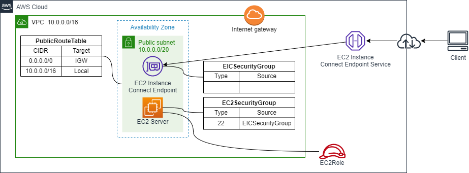
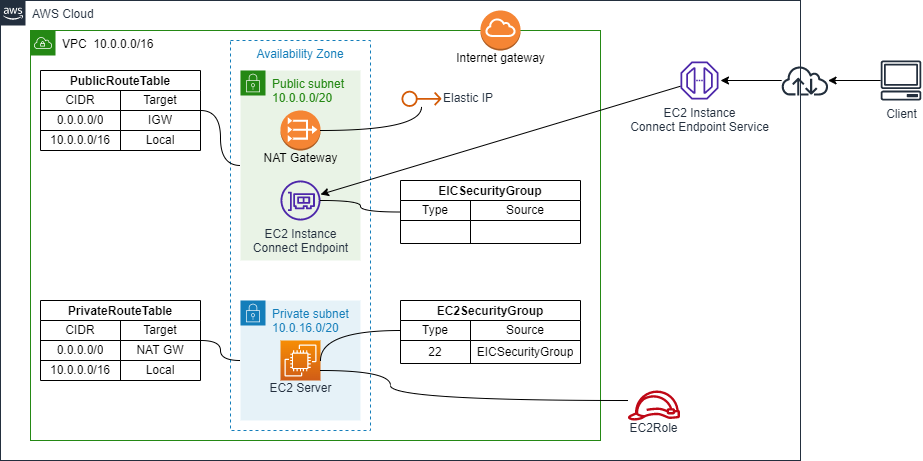

# Create an EC2 and connect using EC2 Instance Connect (EIC) Endpoint

## AWS Architecture

### EC2 in a Public Subnet



### EC2 in a Private Subnet



## How to run

- Select `SystemName` and `TemplateFileName` according to whether you want to place EC2 in a public subnet or in a private subnet

```sh
Region=ap-northeast-1
AvailabilityZone=ap-northeast-1a

SystemName=sample-ec2-eic-public
TemplateFileName=./ec2_eic_public.yaml

# SystemName=sample-ec2-eic-private
# TemplateFileName=./ec2_eic_private.yaml

aws cloudformation deploy \
--region "${Region}" \
--stack-name "${SystemName}" \
--template-file ${TemplateFileName} \
--capabilities CAPABILITY_NAMED_IAM \
--parameter-overrides \
SystemName="${SystemName}" \
AvailabilityZone="${AvailabilityZone}"
```

## How to connect to an EC2

### Easy test

```
aws ec2-instance-connect ssh --instance-id i-00000000000000000 --os-user ubuntu --connection-type eice
```

### SSH

- Configure `~/.ssh/config`
  - Push SSH key, then open SSH tunnel

```
# ~/.ssh/config
Host i-* mi-*
    ProxyCommand sh -c "aws ec2-instance-connect send-ssh-public-key --instance-id %h --instance-os-user %r --ssh-public-key 'file://~/.ssh/id_rsa.pub' && aws ec2-instance-connect open-tunnel --instance-id %h"

# (Optional) To specify host id
Host ec2-server
    HostName i-00000000000000000
    User ubuntu
    ProxyCommand sh -c "aws ec2-instance-connect send-ssh-public-key --instance-id %h --instance-os-user %r --ssh-public-key 'file://~/.ssh/id_rsa.pub' && aws ec2-instance-connect open-tunnel --instance-id %h"

# (Optional) Sample to create tunnel
Host ec2-server-tunnel
    HostName i-00000000000000000
    User ubuntu
    ProxyCommand sh -c "aws ec2-instance-connect send-ssh-public-key --instance-id %h --instance-os-user %r --ssh-public-key 'file://~/.ssh/id_rsa.pub' && aws ec2-instance-connect open-tunnel --instance-id %h --remote-port 22 --local-port 2222"
```

- (Optional) For Windows
  - Replace 
    - `sh -c`
    - `C:\Windows\System32\WindowsPowerShell\v1.0\powershell.exe`

- Connect

```
ssh ubuntu@i-00000000000000000
ssh ec2-server
```

```
ssh ec2-server-tunnel
ssh ubuntu@localhost -p 2222
```
